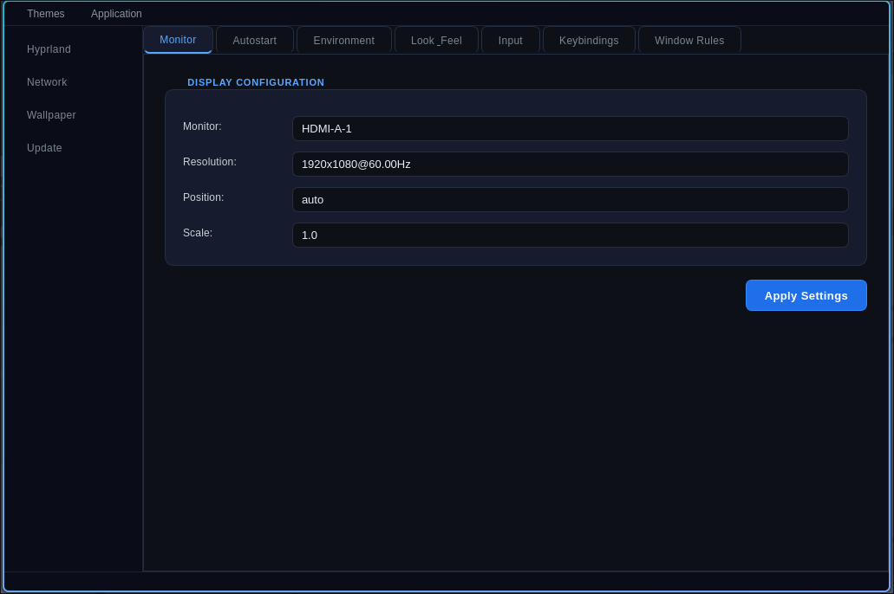

<div align="center">

# hypr-set

**A graphical interface for editing your `hyprland.conf` — and soon `hyprland.lua` — without ever touching a terminal.**


</div>

---

## About

**hypr-set** is a GUI tool that makes managing your Hyprland configuration simple and accessible. Instead of manually editing config files in a terminal, hypr-set gives you a clean interface to tweak your setup visually.

The long-term goal is for hypr-set to become a central hub for all your Hyprland and Linux settings — a one-stop-shop for your desktop configuration.

A companion shell script, `hypr-set.sh`, is also included for those who prefer the command line. It covers most of the core functionality, though some features are exclusive to the GUI.

---

## Preview



---

## Installation

```bash
# Clone the repo
git clone https://github.com/EST2374/hypr-set
cd hypr-set

# Install dependencies
sudo pacman -S python-pipx
sudo pacman -S pyside6

# Install and run
pipx ensurepath
pipx install -e .
source ~/.bashrc
hypr-set
```

> **Requirements:** Hyprland, Python, PySide6

---

## Usage

### GUI

Simply run `hypr-set` after installation to launch the graphical interface.

### Command Line (`hypr-set.sh`)

For terminal users, the companion script offers a straightforward CLI:

```bash
./hypr-set.sh
Usage: hypr-set [setting] [arg] [arg2] [value]

Settings:
  monitor      Monitor configuration
  autostart    Autostart programs
  environment  Environment variables
  look         Look and feel (borders, gaps, colors)
  input        Input devices
  keybinding   Keybindings
  window       Window rules

For more help: hypr-set [setting] help
```

---

## Contributing

Contributions are welcome! Feel free to open an issue for bug reports or feature requests, or submit a pull request directly.

---

<div align="center">

made with ♥ by [EST2374](https://github.com/EST2374) · MIT License

</div>
